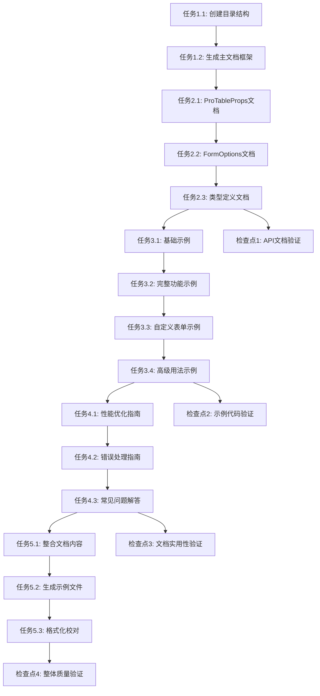

# ListPage 组件文档生成 - 任务拆解

## 任务列表（按执行顺序排列）

### 阶段一：文档结构准备
- [x] **任务1.1**：创建文档目录结构
  - **技术方案引用**：文档结构设计 → 主文档文件结构
  - **验收标准**：创建完整的文档目录和文件框架
  - **依赖关系**：无前置依赖
  - **外部资源**：无

- [x] **任务1.2**：生成主文档框架
  - **技术方案引用**：文档结构设计 → 主文档文件结构
  - **验收标准**：README.md 包含完整的章节结构和目录
  - **依赖关系**：依赖任务1.1
  - **外部资源**：无

### 阶段二：API 参考文档生成
- [x] **任务2.1**：生成 ProTableProps 接口文档
  - **技术方案引用**：用例实现方案 → Props、状态、生命周期
  - **验收标准**：完整的 Props 接口说明，包含类型、默认值、使用说明
  - **依赖关系**：依赖任务1.2
  - **外部资源**：src/components/ListPage/interface.ts

- [x] **任务2.2**：生成 FormOptions 配置文档
  - **技术方案引用**：接口调用方案 → API请求、响应数据类型定义
  - **验收标准**：所有表单项类型的详细配置说明
  - **依赖关系**：依赖任务2.1
  - **外部资源**：src/components/ListPage/interface.ts

- [x] **任务2.3**：生成类型定义参考文档
  - **技术方案引用**：组件设计方案 → Props、状态、生命周期
  - **验收标准**：泛型使用说明和工具类型文档
  - **依赖关系**：依赖任务2.2
  - **外部资源**：src/components/ListPage/interface.ts

### 阶段三：使用示例代码生成
- [ ] **任务3.1**：生成基础使用示例
  - **技术方案引用**：用例1：基础使用示例生成
  - **验收标准**：可运行的最简单使用示例，包含完整的类型定义
  - **依赖关系**：依赖任务2.3
  - **外部资源**：src/components/ListPage/index.tsx

- [ ] **任务3.2**：生成完整功能示例
  - **技术方案引用**：用例2：完整功能示例生成
  - **验收标准**：包含搜索表单、操作区域的完整示例
  - **依赖关系**：依赖任务3.1
  - **外部资源**：src/pages/advertising/advertisers.tsx

- [ ] **任务3.3**：生成自定义表单项示例
  - **技术方案引用**：用例3：自定义表单项示例生成
  - **验收标准**：展示 Custom 类型表单项的使用方法
  - **依赖关系**：依赖任务3.2
  - **外部资源**：src/components/ListPage/RenderFormItem.tsx

- [ ] **任务3.4**：生成高级用法示例
  - **技术方案引用**：数据流设计方案 → 数据获取、更新、缓存策略
  - **验收标准**：类型化使用、性能优化、错误处理等高级示例
  - **依赖关系**：依赖任务3.3
  - **外部资源**：src/components/ListPage/SearchForm.tsx

### 阶段四：最佳实践和FAQ
- [ ] **任务4.1**：生成性能优化指南
  - **技术方案引用**：异常处理方案 → 网络错误、业务异常、边界情况
  - **验收标准**：包含 useMemo、useCallback 等优化建议的具体代码
  - **依赖关系**：依赖任务3.4
  - **外部资源**：无

- [ ] **任务4.2**：生成错误处理指南
  - **技术方案引用**：异常处理方案 → 网络错误、业务异常、边界情况
  - **验收标准**：完整的错误处理策略和代码示例
  - **依赖关系**：依赖任务4.1
  - **外部资源**：无

- [ ] **任务4.3**：生成常见问题解答
  - **技术方案引用**：数据流设计方案 → 加载时机
  - **验收标准**：至少包含10个常见问题及解决方案
  - **依赖关系**：依赖任务4.2
  - **外部资源**：无

### 阶段五：文档整合和优化
- [ ] **任务5.1**：整合所有文档内容
  - **技术方案引用**：文档结构设计 → 主文档文件结构
  - **验收标准**：主文档包含所有章节内容，结构清晰
  - **依赖关系**：依赖任务4.3
  - **外部资源**：无

- [ ] **任务5.2**：生成示例代码文件
  - **技术方案引用**：文档结构设计 → 示例代码文件结构
  - **验收标准**：所有示例代码保存为独立的 .tsx 文件
  - **依赖关系**：依赖任务5.1
  - **外部资源**：无

- [ ] **任务5.3**：文档格式化和校对
  - **技术方案引用**：实现策略 → 质量保证
  - **验收标准**：文档格式统一，无语法错误，链接正确
  - **依赖关系**：依赖任务5.2
  - **外部资源**：无

## 检查点（关键节点的验证要求）

### 检查点1：API文档完整性验证（任务2.3完成后）
- [ ] 所有 ProTableProps 属性都有详细说明
- [ ] 所有 FormOptions 类型都有使用示例
- [ ] 类型定义与源码完全一致
- [ ] 泛型使用说明清晰准确

### 检查点2：示例代码可用性验证（任务3.4完成后）
- [ ] 所有示例代码可以通过 TypeScript 检查
- [ ] 基础示例可以直接复制使用
- [ ] 复杂示例逻辑正确完整
- [ ] 自定义组件示例具有代表性

### 检查点3：文档实用性验证（任务4.3完成后）
- [ ] 新手能够快速上手
- [ ] 高级用法有详细指导
- [ ] 常见问题覆盖实际使用场景
- [ ] 最佳实践具有指导价值

### 检查点4：整体质量验证（任务5.3完成后）
- [ ] 文档结构逻辑清晰
- [ ] 内容准确无误
- [ ] 格式规范统一
- [ ] 示例代码组织合理

## 外部资源链接

### 组件源码文件
- **ListPage 主组件**：`src/components/ListPage/index.tsx`
- **接口定义文件**：`src/components/ListPage/interface.ts`
- **搜索表单组件**：`src/components/ListPage/SearchForm.tsx`
- **表单项渲染组件**：`src/components/ListPage/RenderFormItem.tsx`

### 使用示例参考
- **广告主管理页面**：`src/pages/advertising/advertisers.tsx`
- **广告计划页面**：`src/pages/advertising/plan.tsx`

### 项目配置文件
- **TypeScript 配置**：`tsconfig.json`
- **包依赖配置**：`package.json`

## 依赖关系图

## 预估工作量

- **阶段一**：文档结构准备 - 2个任务，预计30分钟
- **阶段二**：API参考文档 - 3个任务，预计60分钟
- **阶段三**：使用示例代码 - 4个任务，预计90分钟
- **阶段四**：最佳实践FAQ - 3个任务，预计60分钟
- **阶段五**：文档整合优化 - 3个任务，预计45分钟

**总计**：15个任务，预计285分钟（约4.75小时）
