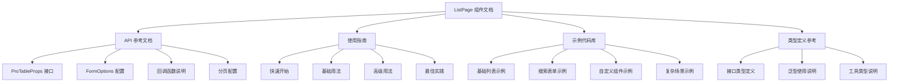
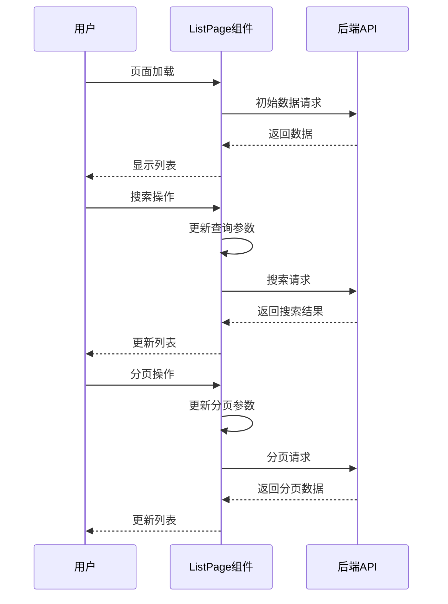

# ListPage 组件文档生成 - 技术方案设计

## 架构设计图



## 用例实现方案

### 用例1：基础使用示例生成

**实现代码示例**：
```typescript
// 最简单的使用方式
import ListPage from '@/components/ListPage';
import type { ColumnsType } from 'antd/es/table';

interface DataItem {
  id: string /** 数据ID */;
  name: string /** 名称 */;
  status: number /** 状态 */;
}

export function BasicListExample() {
  const columns: ColumnsType<DataItem> = [
    {
      title: '名称',
      dataIndex: 'name',
      key: 'name',
    },
    {
      title: '状态',
      dataIndex: 'status',
      key: 'status',
    },
  ];

  const queryFn = async (params: any) => {
    // 模拟API调用
    return {
      data: [],
      recordsCount: 0,
      page: 1,
      pageSize: 10,
    };
  };

  return (
    <ListPage
      columns={columns}
      queryFn={queryFn}
    />
  );
}
```

### 用例2：完整功能示例生成

**实现代码示例**：
```typescript
// 包含搜索表单的完整示例
import ListPage from '@/components/ListPage';
import type { FormOptions } from '@/components/ListPage/interface';
import { Button, Space, Tag } from 'antd';

export function FullFeatureExample() {
  const columns = [
    {
      title: '名称',
      dataIndex: 'name',
      key: 'name',
    },
    {
      title: '状态',
      dataIndex: 'status',
      key: 'status',
      render: (status: string) => (
        <Tag color={status === 'active' ? 'green' : 'red'}>
          {status === 'active' ? '启用' : '禁用'}
        </Tag>
      ),
    },
    {
      title: '操作',
      key: 'action',
      render: (_, record) => (
        <Space>
          <Button type="link" size="small">编辑</Button>
          <Button type="link" size="small" danger>删除</Button>
        </Space>
      ),
    },
  ];

  const formOptions: FormOptions[] = [
    {
      label: '名称',
      fieldName: 'name',
      type: 'Input',
      placeholder: '请输入名称',
    },
    {
      label: '状态',
      fieldName: 'status',
      type: 'Select',
      options: [
        { label: '启用', value: 'active' },
        { label: '禁用', value: 'inactive' },
      ],
    },
    {
      label: '创建时间',
      fieldName: 'createTime',
      type: 'DatePicker',
    },
  ];

  const queryFn = async (params: any) => {
    console.log('查询参数:', params);
    // 实际API调用逻辑
    return {
      data: [],
      recordsCount: 0,
      page: params?.pageIndex || 1,
      pageSize: params?.pageSize || 10,
    };
  };

  return (
    <ListPage
      columns={columns}
      queryFn={queryFn}
      formOptions={formOptions}
      defaultQueryData={{ status: 'active' }}
      operation={
        <Button type="primary">新建</Button>
      }
    />
  );
}
```

### 用例3：自定义表单项示例生成

**实现代码示例**：
```typescript
// 自定义表单项使用示例
import { TreeSelect } from 'antd';
import ListPage from '@/components/ListPage';
import type { FormOptions } from '@/components/ListPage/interface';

export function CustomFormItemExample() {
  const formOptions: FormOptions[] = [
    {
      label: '部门',
      fieldName: 'department',
      type: 'Custom',
      component: (
        <TreeSelect
          placeholder="请选择部门"
          treeData={[
            {
              title: '技术部',
              value: 'tech',
              children: [
                { title: '前端组', value: 'frontend' },
                { title: '后端组', value: 'backend' },
              ],
            },
          ]}
        />
      ),
    },
  ];

  const columns = [
    {
      title: '姓名',
      dataIndex: 'name',
      key: 'name',
    },
    {
      title: '部门',
      dataIndex: 'department',
      key: 'department',
    },
  ];

  const queryFn = async (params: any) => {
    return {
      data: [],
      recordsCount: 0,
      page: 1,
      pageSize: 10,
    };
  };

  return (
    <ListPage
      columns={columns}
      queryFn={queryFn}
      formOptions={formOptions}
    />
  );
}
```

## 接口调用方案

### API请求、响应数据类型定义

```typescript
// 查询参数接口定义
interface QueryParams {
  pageIndex?: number /** 页码，从1开始 */;
  pageSize?: number /** 每页条数 */;
  timestamp?: number /** 时间戳，用于缓存控制 */;
  [key: string]: unknown /** 其他查询参数 */;
}

// 分页响应数据接口定义
interface PaginatedResponse<TRecord = unknown> {
  data: TRecord[] /** 数据列表 */;
  page?: number /** 当前页码 */;
  pageSize?: number /** 每页条数 */;
  pageCount?: number /** 总页数 */;
  recordsCount?: number /** 总记录数 */;
  [key: string]: unknown /** 其他响应字段 */;
}

// 查询函数类型定义
type QueryFunction<TQueryParams, TResponse> = (
  params?: TQueryParams
) => Promise<TResponse>;
```

## 组件设计方案

### Props、状态、生命周期

```typescript
// 主组件 Props 设计
interface ProTableProps<
  TRecord = Record<string, unknown>,
  TQueryParams extends QueryParams = QueryParams,
  TResponse extends PaginatedResponse<TRecord> = PaginatedResponse<TRecord>
> {
  // 必需属性
  columns: ColumnsType<TRecord> /** 表格列配置 */;
  queryFn: (params?: TQueryParams) => Promise<TResponse> /** 数据查询函数 */;
  
  // 可选属性
  defaultQueryData?: TQueryParams /** 默认查询参数 */;
  children?: React.ReactNode /** 自定义内容 */;
  operation?: React.ReactNode /** 操作区域内容 */;
  showSearchForm?: boolean /** 是否显示搜索表单，默认true */;
  pagination?: IPaginationProps /** 分页配置 */;
  showPagination?: boolean /** 是否显示分页，默认true */;
  needPagination?: boolean /** 是否需要分页，默认true */;
  formOptions?: FormOptions[] /** 搜索表单配置 */;
  tableProps?: Omit<ITableProps, 'dataSource'> /** 表格属性 */;
  emptyText?: string /** 空数据提示文字 */;
  tableRowKey?: string | number /** 表格行key */;
  autoSearch?: boolean /** 是否自动搜索 */;
  form?: FormInstance /** 外部表单实例 */;
  debounceDelay?: number /** 防抖延迟时间 */;
  refreshKey?: number /** 外部刷新标识 */;
}

// 组件状态设计
interface ComponentState {
  queryData: QueryParams /** 当前查询参数 */;
  data: PaginatedResponse<Record<string, unknown>> | null /** 表格数据 */;
  isLoading: boolean /** 首次加载状态 */;
  isFetching: boolean /** 后续加载状态 */;
}
```

## UI设计方案

### 尺寸、颜色、字体、布局、装饰元素

**布局结构**：
- 搜索表单区域：Card 包装，底部 padding 为 0
- 表格区域：Card 包装，顶部间距 16px
- 操作区域：位于表格上方，padding 20px

**样式规范**：
```css
/* 搜索表单样式 */
.search-form-wrapper {
  margin-bottom: 16px;
}

.search-form-items {
  margin-bottom: 0;
}

.search-action {
  display: flex;
  flex-direction: column;
  gap: 8px;
}

/* 表格区域样式 */
.operation-content {
  margin-bottom: 16px;
}

/* 响应式布局 */
@media (max-width: 768px) {
  .search-form-items .ant-col {
    span: 24;
  }
}
```

## 数据流设计方案

### 数据获取、更新、缓存策略、加载时机



**数据加载时机**：
1. 组件挂载时自动加载
2. 查询参数变化时重新加载
3. 外部 refreshKey 变化时刷新
4. 分页参数变化时加载对应页面数据

**缓存策略**：
- 使用 timestamp 防止缓存
- 防重复调用机制
- 状态管理优化

## 埋点设计方案

### 埋点方式、参数上报、触发时机

**无埋点需求**：当前文档生成任务不涉及埋点功能。

## 异常处理方案

### 网络错误、业务异常、边界情况

```typescript
// 查询函数错误处理示例
const queryFn = async (params: QueryParams) => {
  try {
    const response = await api.getData(params);
    return response;
  } catch (error) {
    console.error('数据获取失败:', error);
    
    // 网络错误处理
    if (error instanceof TypeError) {
      message.error('网络连接失败，请检查网络设置');
    }
    
    // 业务异常处理
    if (error.response?.status === 401) {
      message.error('登录已过期，请重新登录');
      // 跳转到登录页
    }
    
    // 返回空数据结构，避免组件崩溃
    return {
      data: [],
      recordsCount: 0,
      page: 1,
      pageSize: 10,
    };
  }
};

// 组件内部错误边界
const fetchData = useCallback(async (params: QueryParams) => {
  // 防止重复调用
  if (isFetchingRef.current) {
    return;
  }

  try {
    isFetchingRef.current = true;
    setIsFetching(true);
    
    if (!data) {
      setIsLoading(true);
    }

    const result = await queryFnRef.current(params);
    setData(result);
    
  } catch (err) {
    const error = err as Error;
    console.error('数据获取失败:', error);
    
    // 设置空数据，保持UI稳定
    setData({
      data: [],
      recordsCount: 0,
      page: 1,
      pageSize: 10,
    });
    
  } finally {
    setIsLoading(false);
    setIsFetching(false);
    isFetchingRef.current = false;
  }
}, [data]);
```

## 文档结构设计

### 主文档文件结构

```markdown
# ListPage 组件使用文档

## 概述
- 组件介绍
- 主要特性
- 适用场景

## 快速开始
- 安装和导入
- 基础使用示例
- 核心概念

## API 参考
- ProTableProps 接口
- FormOptions 配置
- 回调函数说明
- 类型定义

## 使用指南
- 基础列表
- 搜索表单
- 自定义组件
- 高级配置

## 最佳实践
- 性能优化
- 错误处理
- 类型安全
- 代码组织

## 常见问题
- FAQ
- 故障排除
- 迁移指南

## 示例代码
- 完整示例
- 场景演示
- 代码片段
```

### 示例代码文件结构

```
examples/
├── BasicExample.tsx          # 基础使用示例
├── SearchFormExample.tsx     # 搜索表单示例
├── CustomFormExample.tsx     # 自定义表单项示例
├── PaginationExample.tsx     # 分页配置示例
├── TypedExample.tsx          # 类型化使用示例
└── AdvancedExample.tsx       # 高级用法示例
```

## 实现策略

### 代码生成策略

1. **静态分析**：解析 interface.ts 文件，提取所有类型定义
2. **示例生成**：基于真实使用场景（advertisers.tsx）创建可运行示例
3. **文档组织**：按照用户学习路径组织内容结构
4. **类型安全**：确保所有示例代码通过 TypeScript 检查

### 质量保证

1. **准确性**：所有API说明与源码保持一致
2. **完整性**：覆盖所有公开接口和使用场景
3. **可用性**：示例代码可直接复制使用
4. **易读性**：文档结构清晰，注释详细
